DAY1 (12/12/2023) -

  1.Read about what is angular section from wiki. 

  2.Performed and understand example application which is mentioned in angular doc

	  Concepts -> App navigation,managing data,form etc 

  3.Understand the architecture of Components and template in angular

  Implementation :  [https://github.com/tejasnoovosoft/example-application](https://github.com/tejasnoovosoft/example-application)

DAY2 (13/12/2023) -
  
  1.Dependency Injection of Services. 
  
  2.Data Binding.  
  
  3.Pipes and Directives Overview. 
  
  4.Template Variables 
  
  5.Implement a small e-commerce project : [https://github.com/tejasnoovosoft/angular/tree/master/src](https://github.com/tejasnoovosoft/angular/tree/master/src)

  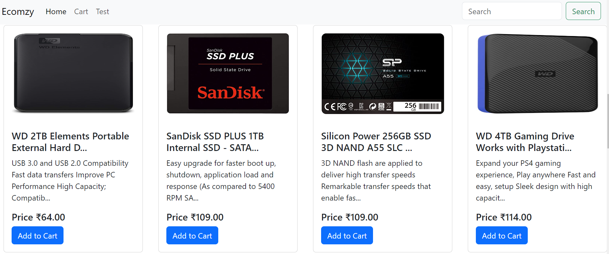

DAY3 (14/12/2023) - 

  1.Template : [Template-Binding](https://github.com/tejasnoovosoft/angular/tree/master/src/app/classstylebinding)

  2.Directives : [Directives](https://github.com/tejasnoovosoft/angular/tree/master/src/app/directives)

  3.Component : Overview,Lifecycle

  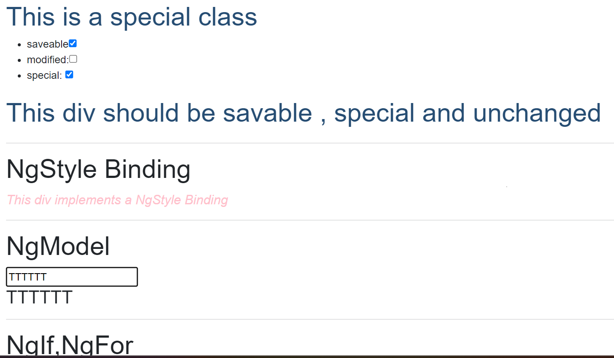
  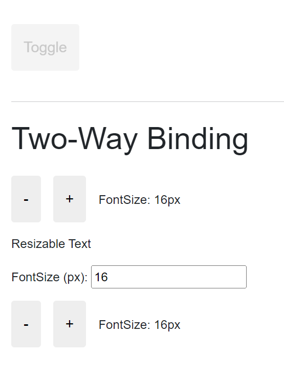

DAY4 (15/12/2023) -
  1.Components Life Cycle

  2.Implement Hook functions of component

  3.Sharing Data between parent and child component(@Input(),@Output())

  Link -> [Components-Implementation](https://github.com/tejasnoovosoft/angular/tree/master/src/app/component)

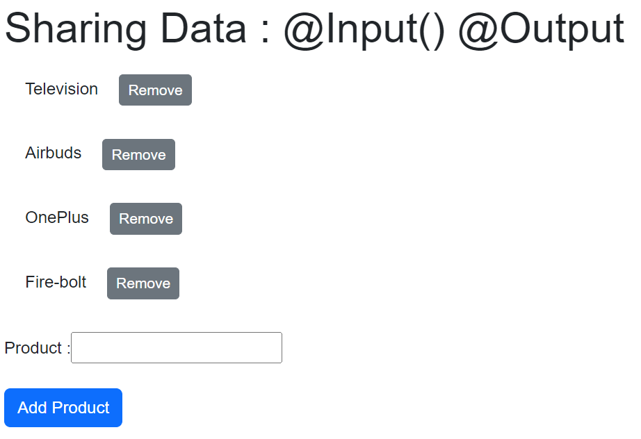

  4.Decorators - ViewChild,ViewChildren

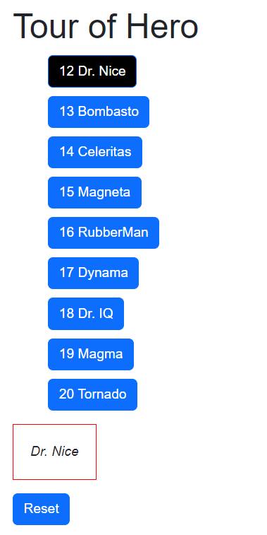

DAY5 (18/12/2023)

  1.Revised Decorators - (ViewChild,ViewChildren)

  2.Pipes - [Implementation of Pipes](https://github.com/tejasnoovosoft/angular/tree/master/src/app/pipes)

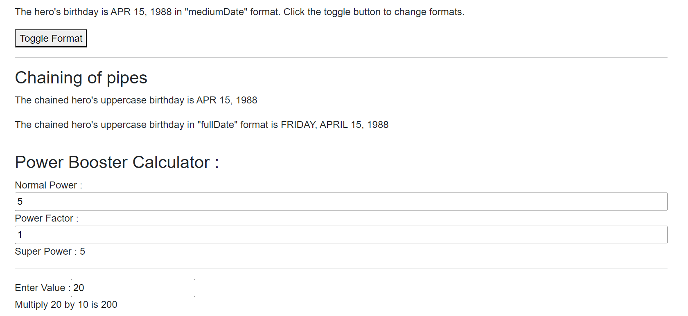

  3.Modules

DAY6 (19/12/2023)

  1.Feature Module - [Implementation](https://github.com/tejasnoovosoft/angular/tree/master/src/app/products)

  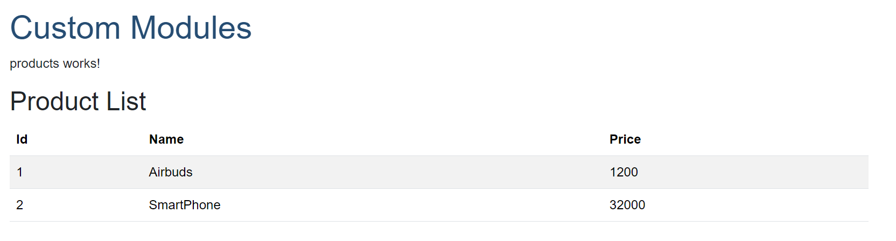  

  2.Dependency Injection and Services - [Implementation](https://github.com/tejasnoovosoft/angular/tree/master/src/app/dep-injection)

  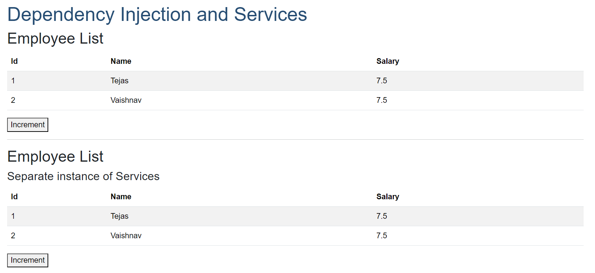

  3.Routing and Navigation - [Implementation](https://github.com/tejasnoovosoft/angular/tree/master/src/app/routing)

DAY7 (20/12/2023)
  
  1.Forms - [Implementation](https://github.com/tejasnoovosoft/angular/tree/master/WEEK2/forms/src/app)
  
  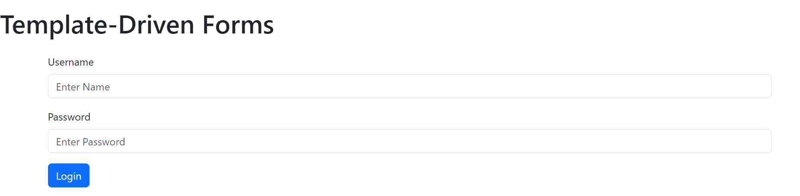

  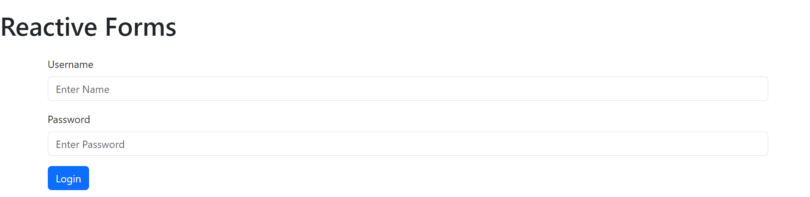

  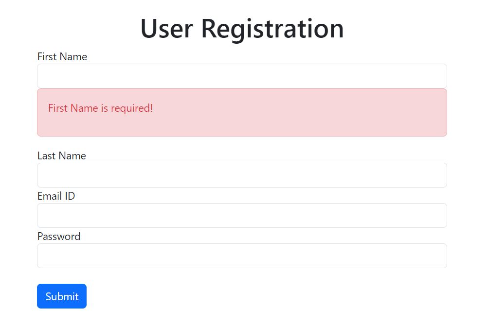

  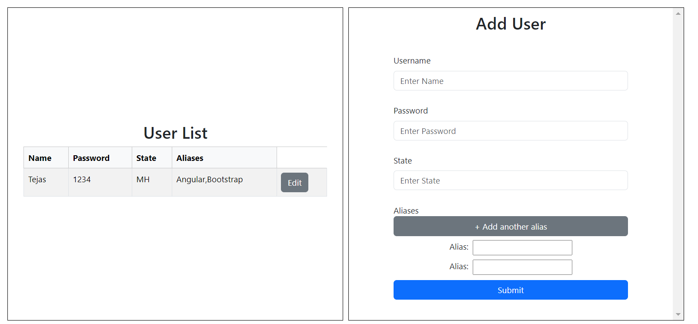

